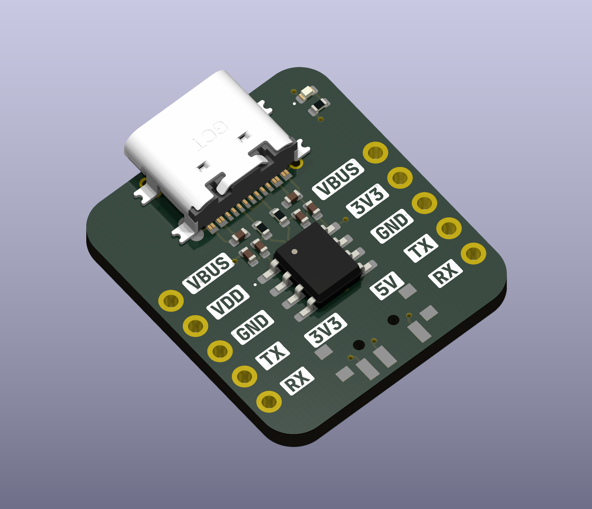

# SerialBuddy-HT42B534

[Schematics/Board](https://kicanvas.org/?github=https%3A%2F%2Fgithub.com%2F21Whales%2FSerialBuddy-HT42B534%2Ftree%2Fmain%2Fhardware%2Frev1)

## Overview

SerialBuddy-HT42B534 is a USB to UART interface based on the Holtek HT42B534 chip, designed with a focus on simplicity and versatility. It is suitable for breadboard use, featuring clearly labeled pins and supporting dual voltage supply (3.3V and 5V). The device also offers selectable I/O voltage (3.3V or 5V), and excludes less commonly used pins like RTS and CTS for a streamlined user experience. SerialBuddy-HT42B534 is an open-source hardware project distributed under the BSD 3-Clause License.

## Features

- USB to UART interface
- Breadboard-friendly design
- Clearly labeled pins for easy reference
- Dual voltage supply (3.3V and 5V)
- Selectable I/O voltage (3.3V or 5V)
- Excludes less commonly used pins like RTS and CTS for simplicity
- Open-source hardware under BSD 3-Clause License

## Pin Names

- **TX**: Transmit Data
- **RX**: Receive Data
- **GND**: Ground
- **VDD**: Power Supply (Selectable: 3.3V or 5V)
- **VBUS**: 5V from USB Bus
- **3V3**: 3.3V from internal regulator

## License

SerialBuddy-HT42B534 is distributed under the [BSD 3-Clause License](LICENSE).

## Contributing

We welcome contributions! Feel free to submit bug reports, feature requests, or pull requests.
